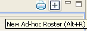
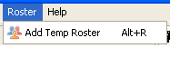
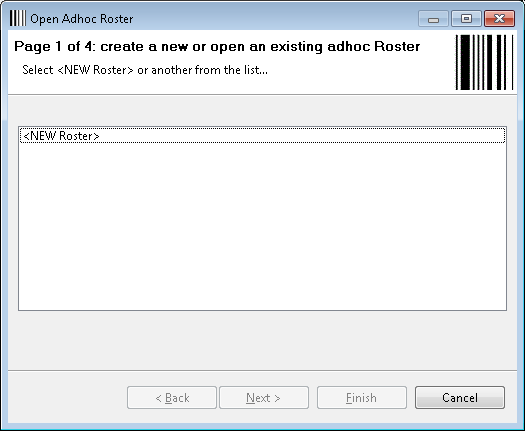
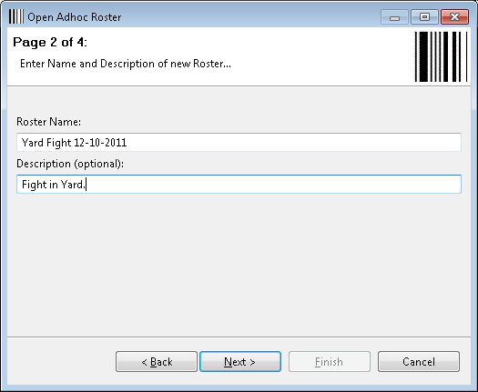
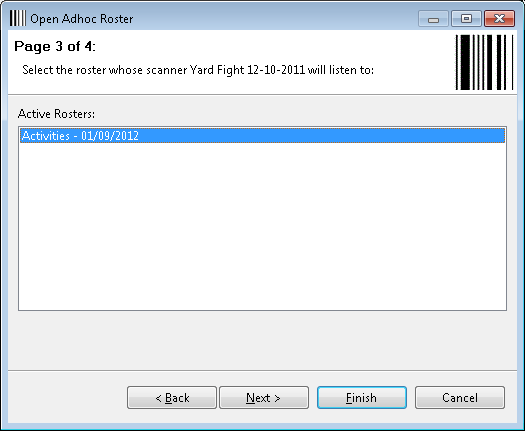
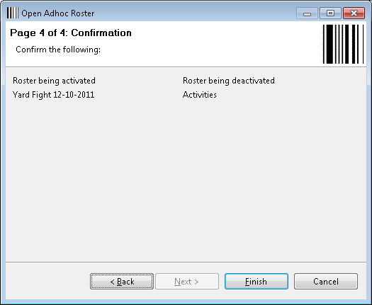
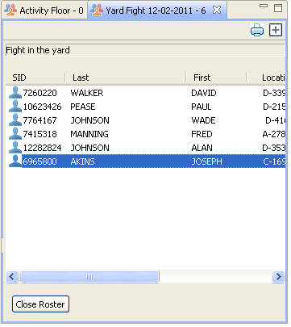
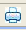

# Ad-hoc \(Temporary\) Roster

An ad-hoc roster is used to record a specific unplanned event, where a quick & accurate list of persons present is needed.

### **Example:**

If a fight broke out in a yard, and it was decided to create a record of everyone that was there, an ad-hoc roster could be created for all Offenders involved and they would be scanned for a documented history related to the event.

## Start the Ad-Hoc Roster Wizard

There are three ways to start the Ad-Hoc Roster Wizard:

1. Click the plus icon  in the upper right-hand of the Roster frame.

2. Click Roster at the top of the frame, and then click Add Temp Roster.

3. Press Alt-R key combination at the same time.

## Ad-Hoc Roster Wizard

Now that the Ad-hoc Wizard has been opened, you should see a window that states Page 1 of 4:

1. Click \, and then click **Next.**

2. The next page will prompt for a name and description of the new ad-hoc roster. Enter a roster name and event description to be captured for the ad-hoc roster, then click **Next.**

3. The next page asks which scanner to use to scan Offenders into the ad-hoc roster. Click on the Roster that you are going to ‘borrow’ the barcode scanner from, then click **Next.**

4. The last page confirms what you’ve entered – if all looks correct, click Finish.

Now the ad-hoc Roster is open and receiving scan from the barcode scanner. No rules will be enforced for each scan.

> \[**Note:** the scanner is now tied to the new ad-hoc Roster – all scans performed on this scanner will go to the ad-hoc Roster, rather than the Roster the scanner had previously been attached to.\]

## Close Ad-Hoc Roster

Once all Offenders have been scanned, select the **Close Roster** button and the ad-hoc roster will close. The specific ad-hoc roster can be opened up later and Offenders can be added or removed as needed. Once the ad-hoc roster is closed, the scanner returns to scanning for the original roster, which in this case is the Activity Floor roster.

## Print

Staff may print the ad-hoc roster just as they would with a regular Roster, by clicking the printer icon on the right-hand corner of the Roster frame. 

## Triggers

Triggers are used to perform a specific action when a qualifying scan occurs. Currently there are two types of triggers that Schedule Track can perform:

## **COM Port:**

This trigger type can send specific data \(bytes\) to another serial port attached to the PC.

### **Example:**

An electrical relay is attached to COM3 of the PC, and that relay turns on or off a light near the checkpoint. The trigger can be set to turn on the light when inmate \#12345678 scans into the Activities area.

## **Email:**

This trigger type can send an email to a specified email address.

### **Example:**

An email can be automatically sent to this.address@doc.state.or.us every time inmate \#12345678 attempt to scan into the Education area and is denied.

