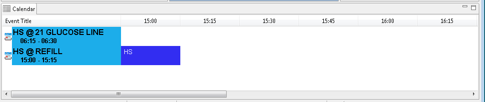

# Overview of Main Window and Four Panels

## Person Panel

The Person Panel is displayed in the upper left of the main window, and contains the person’s photo and other information.

## Search Panel

The Search Panel is displayed in the upper center of the main window, and provides a method of finding inmates located at the local institution, or any Personnel. Staff may select from the results to add to the scanner list.

## Roster Panel

The Roster Panel is shown in the upper right of the main window, and displays a tab \(Roster\) for each scanner attached to the computer. Each Roster displays all active filters for each scanner and maintains a list of persons scanned into an area. As a card is successfully scanned the person’s information is added to the appropriate roster; a subsequent scan of the same ID card will result in the person being removed from the roster.

A Roster contains the following columns for each person who has scanned IN: ID Number, last name, first name, housing/responsible location, scan time and approved outcomes. As the person scans an ID card, the person’s information is passed through any configured Filters, and if the Filter validation passes, the name is added to the scanner's Roster. Persons may be manually added using the **Search Panel** and removed using the **Scan Out** or **Scan All Out** buttons. Each roster may be printed by selecting the printer icon at the top of the frame.

An ad-hoc roster may be created by using the “Add” icon \(a button with a plus symbol on it\).

## Calendar Panel

The Calendar Panel is displayed below the Person, Search, and Roster panels at the bottom of the main window. Each time an offender scans their ID card, the Calendar panel will display the inmate’s calendar information for the current day. Names of appointments/events are shown in light blue, while the 15 minute time block that correspond to the appointment time are colored in dark blue. Empty or white time blocks represent free time, or no appointment/event.

The Calendar Panel will not show any information when a person other than an inmate is scanned. Use the scroll bar at the bottom of the frame to advance the timeline if needed.

> \[**Note:** You cannot scroll backwards in time, only forwards.\]

