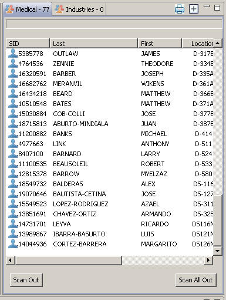
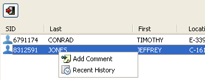
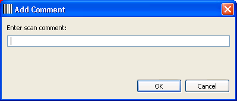
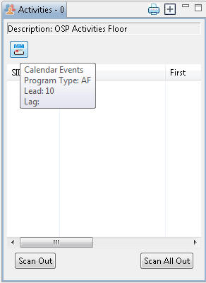
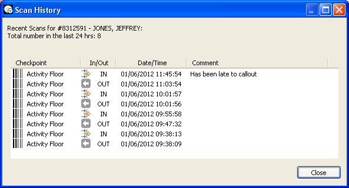
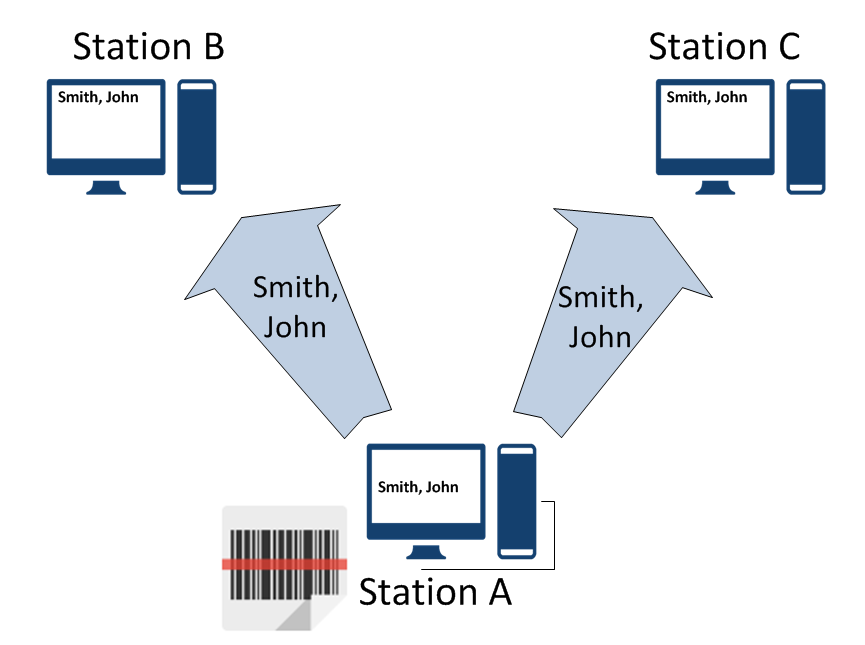
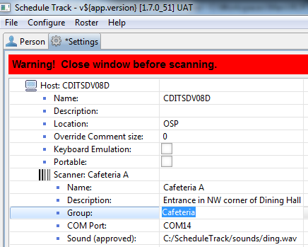

# Rosters Overview

The Roster is the list of persons that have been scanned or allowed into the area the scanner represents. There may be more than one roster if more than one barcode scanner is hooked up to the computer.

Each roster has the following categories, SID, Last name, First name, Location \(Cell\), Scan time and Approved. Only the first three columns are initially displayed; to view all information, scroll right or expand the frame.

[**Jump to Tips and Tricks**](../../../../unions/afscme/)

Just like the Search frame, any roster can be ordered by clicking on any column header in the Roster.

## Add Comment

To attach a comment to a scan:

> \[**Note:** This is different and separate from a Manual Override comment.\]

1. Click a person in a roster list, and then right-click to show the scan options menu:

2. Now click Add Comment and write an appropriate comment about the person’s scan.

3. Click OK when done.

## Manually Scan Out

In order to manually scan a person out of a roster:

1. Select the person 
2. Click the Scan Out button located at the bottom of the Roster frame.

Select the Scan All Out button when the entire roster needs to be cleared. A warning box will appear for confirmation to continue.

## Validation Rules in Effect

At the top of each Roster, just below the Description field, there may be one or more icons displayed. These icons show which rules are being enforced for that Roster. By holding the mouse over the top of the icon, a floating box will appear showing the type of rule in effect and its validation values.

### **Example:**

The Activity Floor roster has a rule of all callouts with the rule of AF. It also shows any lead or lag time the rule may have.

## Print Roster

Staff may print the current roster by clicking the printer icon on the right-hand corner of the Roster frame:

## Show Recent History

To view a person’s recent scan history \(last 24 hrs\):

1. Right-click on the person in the Roster and select Recent History.

2. A dialogue box will then appear and show the Offenders recent scan history.

## Group/Shared Roster

In some situations, an area might be controlled by multiple checkpoints, and it would be helpful if these checkpoints all shared a single list of persons scanned in. For example, a dining area might have 2 entrances and 1 exit: Schedule Track can be configured to where 3 different PC’s can be positioned around the dining area entrances/exits, so that when an offender scans in at one checkpoint, his/her name is shown on all 3 checkpoint screens. Later on, when that inmate scans out at one of the other checkpoints, his/her name is then removed from all 3 checkpoints.

Another example might be scanning staff/volunteers at the facility’s perimeter which has multiple entry/exit points; if a staff member scans in at the front gate, and scans out at the sally port, both checkpoints will show an accurate roster if the ‘Group’ function has been configured as follows:

1. Enter a name in the Group field of the Scanner’s configuration on each of the checkpoints which allow scans in and out of the same area.

2. Use the same ‘Group’ name on each Scanner that is to share it’s list of names with other PCs.

3. When a Group has been configured \(and saved\), the icon above the roster will change slightly – a blue border will appear around the Roster icon, and the group name will be listed in brackets immediately after the Roster’s name:

4. Now each Scanner that has been configured to be in the same Group will share their scans with the other Scanners attached to other PCs that are located at the same facility.

5. Once a group of scanners have been configured and are active, each checkpoint’s roster that is joined to the group will show the same list of names as any other scanner in the same group.

> \[Note: scanners cannot be grouped with other scanners that are at different facilities.\]

6. When a scanner is configured as belonging to a group, it will take a few extra seconds during startup to contact those remote scanners of the same group at other PCs; once they are contacted, any names that are currently on those remote rosters will then be replicated on the local roster.  

