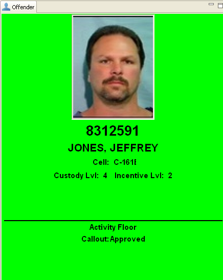
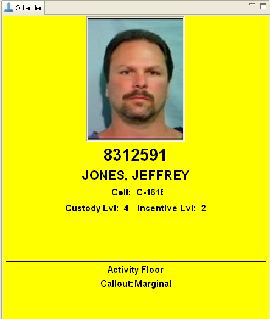
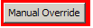
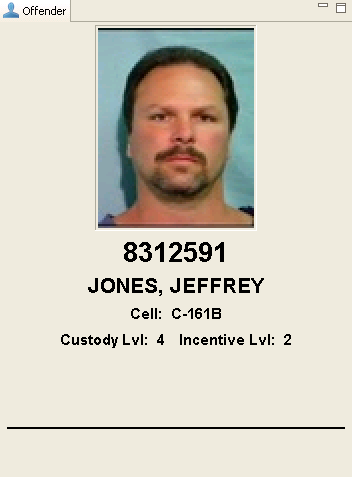
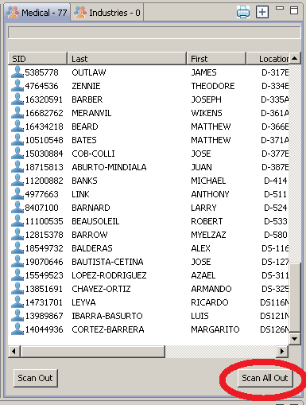

# Scanning ID Cards

Once Schedule Track is running and has been configured correctly, it should be able to start processing individual scans. Each person to be scanned should present their ID card to the attached barcode scanner in a fashion that allows the barcode to be visible. The barcode scanner will typically emit a small ‘beep’ to indicate it read the barcode correctly, and then it will pass the ID number into Schedule Track for processing. The ID number will be used to read the person’s data, then validate that data against any configured Filters for that Roster, and then display the outcome.

> \[**Note:** Outcomes are APPROVED, DENIED, or IGNORED\).\]

When a person scans their ID card there are four possible status outcomes to appear in the Person panel: Approved, Marginal, Denied and Ignored.

## Approved Outcome

A scan with an Approved outcome displays a green background for the Person panel:

## Marginal Outcome

A scan with a Marginal outcome will have a yellow background. Marginal outcomes only occur with Calendar Events and only if the Lead Time has been configured.

### Example:

The following business rules were invoked to produce a Marginal outcome.

* The scanner is for access to the activities floor with the callout of AF.
* The Lead-Time was set to 10 minutes.
* Offender Jones had a callout on the activities floor for 1330 hours.
* The scan occurred at 1321 hours.

## Denied Outcome

A scan will generate a Denied outcome if one or more of the business rules \(filters and limits contained within those filters\) are violated. The panel will display the basic Person information, but will have a red background and also a Manual Override button.

### **Example:**

The Offender was denied access to the Activities Floor because there was no callout on the inmate’s calendar for the Activities Floor for the time the scan occurred.

> \[**NOTE:** If a person is Approved or Denied and the business rules do not seem correct, contact a Schedule Track Super User or TSA, so the configuration can be reviewed.\]

## Manual Override

Staff may perform a Manual Override \(if appropriate\) when a scan generates a Denied outcome; to do so, click the Manual Override button shown on the Person panel.

This will display a box that has a text field with a limit of 150 characters. Use this field to explain the reason for overriding the Denied response. The override will place the person on the Roster. The minimum length is set by a Super User in the configuration panel.

## Ignored Outcome

A scan with an Ignored Outcome will have a gray background. Ignored outcomes are generated when a person scans out, as outgoing scans have no restrictions via validation. If a person is on a Roster, a second scan will remove them from the Roster. The background of the Person panel will be grey which signifies a scan out.

## When a Scan Does Not Work

If an ID card is not readable, the staff at the checkpoint can enter the person’s ID number manually in the Search panel, then click the Search button to find a matching record. Once the correct record is found, 'drag and drop' the correct person from the Search panel onto the correct roster.

## Scanning Out

When a person scans in on a roster, a second scan will remove them from the roster. The background of the Person panel will be gray which signifies a scan out.

## Scan All Out

To remove all names from a roster quickly, select the Scan All Out button at the bottom of the Roster frame; once you confirm, all the persons on the Roster will be scanned out.

