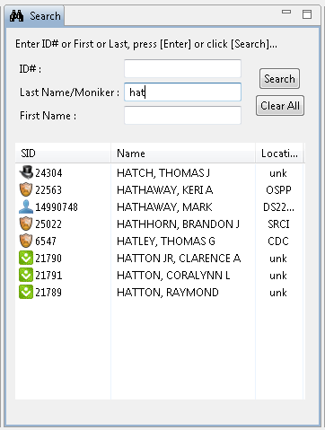
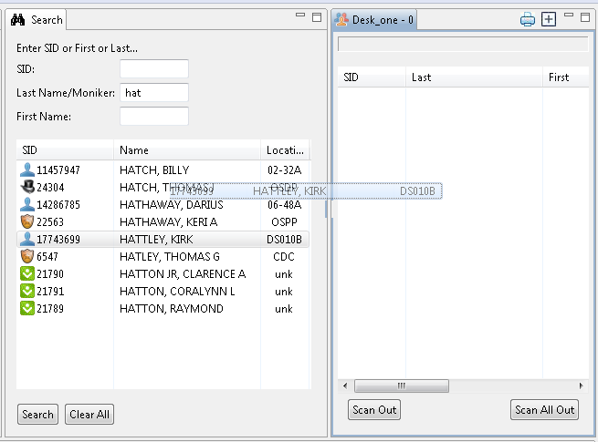

# Searching

The Search panel is used to find a person without using an ID card. There are three input fields used for searching: SID, Last Name/Moniker, and First Name.

## Search by ID Number

To search by ID Number, enter the entire ID Number of the person in the SID field, then press Enter. If an exact match is found, that person will be the only one displayed.

A partial or incorrect SID will return a dialogue box with "_**No Match Results**_" displayed.

## Search by Name or Moniker

A partial search may be used for Last Name/Moniker or First Name. To search for the last name of Hatch, "hat" may be used \(see image above\), and all last names and monikers that begin with "Hat" will display.

## Search Results

Press Enter on the keyboard or click the Search button at the bottom of the Search frame to search for the criteria entered Once the search results have been loaded into the Search panel, you can:

## Sort by any column

Results may be ordered by any of the three columns by clicking on the heading/title of the column you’d like to sort by. Clicking the same column heading will reverse the sort.

## Display Person Details

If a double click is performed on a search results row, the Person panel will update with the person's basic information. The background will be colored gray as there is no validation performed when displaying a person from the Search panel

## Trigger a Scan From Search Results

The Schedule Track operator/user can trigger a scan of any row displayed within the search results, simply by dragging the displayed person from the Search results list onto any Roster’s tab, then dropping the person onto the Roster. To do this:

Select the row with a left-click and hold the mouse button, and move the row to the Roster panel.

Once over the appropriate Roster, release the left mouse button; this will cause the person's ID number to be processed just as if the person had scanned their ID card. The outcome of this scan \(triggered by the drag-n-drop\) will be determined by the configured filters, and may be either Approved, Denied, or Ignored, in the same manner as if the actual ID card had been scanned.

## Clear Results

To clear the Search frame, click Clear All at the bottom of the Search frame.

