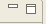

# Additional Resources

## Changing the Size and Layout of a Frame

Each frame display can be resized.

1. Move the cursor between two frames until the cursor pointer changes to two arrows pointing in left and right directions. 
2. Left-click and drag the frame in the direction desired to make it larger or smaller.

## Minimize a Frame

In the upper right-hand corner of each frame are minimize and maximize icons.

 or 

Select minimize icon, which looks like a dash, the frame will minimize to the bottom of the application.

## Maximize a Frame

When the mouse is moved over the left most icon it will display restore, and if clicked reverts the frame back to the way it was. The other button had the frame name on it and will expand the tab to full size.

## When All Else Fails

The Schedule Track application has most of the standard features available in Microsoft Windows such as having the ability to minimize or maximize a frame, and to combine tabs.

If the frames or application display becomes confusing then one method to easily reset the display is to logout of the application and then login again. The display should not have been reset to the default.

## Report Issues to Help Desk

* Contact an Administrator or TSA. 
* Contact the Department of Corrections Help Desk: 
  * **1-866-531-9600**
  * Or Dial _**HELP \(4357\)**_ from a department land line phone.

