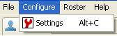
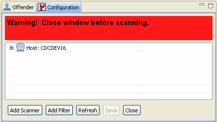
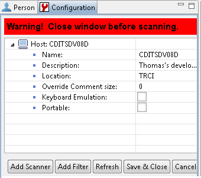
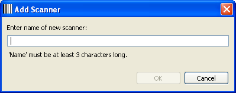
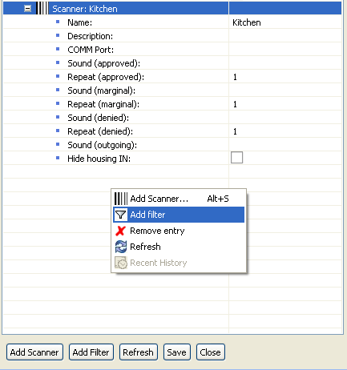

# Configure Schedule Track

## Configure Schedule Track {#configure-schedule-track}

1. To open the **Configuration Panel**, click **Configure** on the Menu Bar.
2. Select **Settings**.

> \[**Note:** if Settings is disabled, the staff member who is logged onto the PC is not authorized to change the configuration; either request via ITS Development that the person be given elevated privileges, or contact a TSA who has those privileges. If a TSA is not available, contact the DOC Help Desk to have an ITS representative assigned to resolve the issue.\]

1. When the **Configuration** frame is opened, the following will be displayed

> The Host name will be the name of the computer hosting the application.

2. Click next  to the computer icon to expand the branch to see and edit the properties for Schedule Track.

## Host Properties

| Properties Name | Properties Description |
| :--- | :--- |
| Name | The name of the computer on which Schedule Track is installed \(cannot be changed\). |
| Description | This is a description of the checkpoint, with a maximum length of 50 characters. |
| Location | From the dropdown list, click the name of the Institution or Facility where the Schedule Track scanner is located. **This value is required.** |
| Override Comment Length | This indicates the minimum number of characters needed to be applied to a comment after a user overrides a denied scan. The default is 0, which means the override comment is optional. The max number of characters allowed for a comment is 50. |
| Keyboard Emulation | This property is used if the scanner connected to the PC is a keyboard emulator instead of the standard RS232. A keyboard emulator needs the Schedule Track application to have focus in order to receive a scan from the device. With an RS232 device, Schedule Track can accept the scan and process it, even if the application does not have focus. |

## Add a Scanner

Add a scanner to the Schedule Track application by performing either of the two approaches.

1A. Right-click any location in the Configuration frame. A pop-up box displays…select Add Scanner.

1B. Click the Add Scanner button at the bottom of the Configuration frame.

2. After selecting to add a scanner, a dialogue box will appear asking for a name of the scanner. The recommended naming convention for a scanner is to use a name related to an area/location, event, or purpose.

### **Example:**

If the scanner is to track Offenders working in the kitchen, a description of Kitchen would be appropriate. If the Offenders are moving into an area, not a specific location, then a name like West Gate would also work. Any name will work as long as it is at least three \(3\) characters long.

1. After naming the scanner, select the OK button. The Scanner will now appear under the Host with a "+" next to its name. Click on  the to expand the Scanner properties.

## Scanner Properties

### **Name:**

This is the name of the scanner and Roster. Use a different scanner for each scanner within an Institution, as Schedule Track Reports module in OMS will list every scanner by name for an institution; if duplicate names, it will become difficult to distinguish between checkpoints.

### **Description:**

This is a description of the scanner, with a maximum length of 50 characters.

### **COMM Port:**

This is the Serial Port on the computer the scanner uses to send information from the scan Offender ID card into Schedule Track.

### **Sounds:**

The Schedule Track application ships with some Wave files \(audio files\). These are used to identify whether a scan is approved, marginal or denied. Click in the cell to the right of Sound \(approved\) and click. A button with three periods will appear.  

Click the  button, a dialogue box will appear with a list of sounds. Select the sound desired by double clicking on the file.

### **Sound \(Approved\):**

This is the sound that will play if an Offender is approved to proceed \(scanning into an area\) based on the business rules established.

### **Repeat \(Approved\):**

This is how many times the approved sound will repeat. The Staff can choose from one to ten \(1 – 10\) times.

### **Sound \(Marginal\):**

This is a sound chosen to play when an Offender has arrived at a marginal time based on a specified Callout. See Callout in this Help for more details.

### **Repeat \(Marginal\):**

This is how many times the Marginal sound will repeat. The user can choose from one to ten \(1 – 10\) times.

### **Sound \(Denied\):**

This is the sound that can be set when an Offender is denied access to continue based on the business rules established.

### **Repeat \(Denied\):**

This is how many times the denied sound will repeat. The user can choose from one to ten \(1 – 10\) times.

### **Sound \(Outgoing\):**

This is a sound that can be set to indicate that an Offender is scanning out of the area and simply indicates the Offender has been removed from the roster.

### **Hide Housing In:**

Institutions may want to enforce a Housing Unit rule, but do not want the Offender added to the roster. By activating this property Offenders are not added to the Roster, but he rule is still enforced allowing only approved Offenders into the area.

### **Show Comments:**

If enabled, any comment captured during the incoming scan will be shown when the same person scans out \(see ‘Note:’ in image below\):

### **Downstream \(still in development\):**

Some checkpoints may be located ‘behind’ others, in that a person must scan into Checkpoint A before scanning into Checkpoint B, then reversing the order when the person is leaving. If enabled, scans into this checkpoint will NOT remove scans from other checkpoints; if not enabled \(default\) scans into this checkpoint will automatically scan out the same person if they are scanned in at another checkpoint.

### Filter Properties and Logic

Schedule Track uses predefined business rules using the AND / OR logic for the different filters.

* Calendar Events:  All calendar events use OR logic with regards to passing Offenders.

### **Example:**

If Schedule Track has Offenders scanning through to multiple possible locations like Health Service or Counseling, the application needs to let both types of Offenders through. For a filter of HS and a filter of COUN, an Offender only needs one of the two filters to return an approved value.

* Custody and Incentive Levels:

All custody, and incentive levels are AND with regards to passing Offenders through the checkpoint.

### **Example:**

With callouts of **HS, COUN and CULINARY**, a custody level greater than 1 and an incentive level of greater than 2 for a scanner, the following must be true for a successful scan.

The Offender would have to have one of the three callouts, a custody level greater than one, and an incentive level greater than 2 to pass with the scanning of their I.D. card.

* Housing:

The housing filter is OR with regards to all the other filters.  
If the housing filter is added to the scenario, the Offender would pass if the housing unit rule passed, even if the Offender failed the others. This allows the Offenders to enter their cell location.

* Volunteer:

The Volunteer filter uses OR logic and will examine a Volunteer’s ID card to determine whether or not that Volunteer has been approved to enter the Facility.

* History:

The History filter uses AND logic so it can be used to prevent someone from scanning back in within a set period of time, or only allow those who have scanned previously within a set period of time – useful for allowing someone to ‘scan back in’ after leaving for a short break, or to prevent someone to enter \(a cafeteria perhaps\) if they had already entered within the past 4 hours.

* ID Card:

All scans are validated to ensure the ID Card used is valid and in good standing. No addition or configuration of any filter is required for this, as ID Card validtion will be performed for every scan regardless of whether the person is scanning in or out, regardless of any and all filters configured, regardless of whether it’s an inmate card or staff/volunteer/contractor/etc.

## Add and Configure Filters

1. Select the scanner to add the filter. The scanner will be highlighted in blue.

  
2. Add the filter in the same manner as adding scanner. Right-click on Scanner-Kitchen and select Add Filter or select the Add Filter button at the bottom of the frame.

After the filter is added, expand the properties.

### **Description:**

This is a description of the filter, with a maximum length of 50 characters.

### **Type:**

This is the type of filter being added. The choices are Calendar, Custody, Housing, Incentive, and Volunteer. The Unknown choice in not valid and is only a placeholder intended for later use. DO NOT USE THIS SELECTION.

### **Active Start Time:**

This is the start time for the filter to be enforced. The time is entered as a 24 hour clock time \(e.g., for 1:30 pm use 13:30\). If left blank, the filter will be enforced at all times \(24/7\).

### **Active End Time:**

This is the end time for the filter to be enforced. The time is entered as a 24-hour clock time. There must be an Active Start Time to use this property.

### **Active Days:**

These are the days of the week for the filter to be enforced. If no days are selected, the filter will be enforced every day.

1. Click in the cell to the right of Active Days. A button with three periods will appear.  By selecting this button, a dialogue box will appear with the days of the week listed.

2. Select the boxes next to the days the filter will enforce. Select OK to save the settings. If Monday and Tuesday are selected the filter will look something like this.

#### Calendar Filter Properties {#calendar-filter-properties}

In addition to the common Filter properties already listed, the Calendar Filter has some unique properties used for filtering callout and other calendar events. When the Type is set to Calendar, the properties under the Calendar Filter will change slightly. Calendar filter uses the “Program Type” instead of minimum and maximum acceptable properties.

* Program Type

Program Type is a code used to match the “Appointment Location” of any Callouts an offender may have on the DOC400. In order for the Calendar filter to work, the code placed here must match what is entered in CIS.

**Example 1:**

An offender has a callout entry on the DOC400, with “CULINARY KITCHEN H” listed as the Appointment Location. To get Schedule Track to accept this event as Approved, the Calendar Filter should have “Culinary” listed in the Program Type; this is the same as what the Callout contains, up to the first blank space in Appointment Location \(Schedule Track will only read the characters from the beginning to the first space in Appointment Location\).

**Wildcards:**

The Program Type field does support the _wildcard; so callouts with Appointment Location values of “MED1”, “MED2”, or “MED3” could all be matched with a Program Type value of “MED_”.

The most common practice currently used by institutions is to use a two or three \(2 or 3\) letter abbreviation at the beginning of the Appointment Location in CIS.

**Example 2:**

“GN” is for the industry section of an institution. The callout entry in CIS would list Appointment Location as “GN LAUNDRY”. In Schedule Track, the correct entry would look like this.

**Lead Time:**

This sets a specified period of time in which an Offender is allowed to proceed prior to a scheduled callout. If the Offender scans prior to the callout, but within the lead-time window, the scan will be accepted as Marginal. When an offender scans in within the lead time window, the **Marginal Sound** will be played.

If no lead-time is entered, the Offender will be rejected until the start of the appointment time for the callout.

**Lag Time:**

This sets a specified period of time in which an Offender is allowed to proceed after the start of a callout. If the Offender scans after the lag time of the callout, the scan will be denied.

If no lag time is entered, the filter will allow an Offender to scan successfully for the entire length of the callout.

The above filter would only be enforced on Mondays and Tuesdays from 13:30 to 14:30 for the callout of GN. Offenders would be given a 10 minute lead-time \(13:20\) to scan in and a 20 minute lag time \(13:50\).

#### Custody Filter {#custody-filter}

**Example:**

Set the Custody Level to be a maximum value to keep Offenders with higher levels from entering an area \(e.g., the yard\). In image below, all Offenders with a custody level of 3 or higher would be rejected.

#### Housing Filter {#housing-filter}

This type validates against an Offender’s current living assignment. It uses both the Minimum and Maximum acceptable properties. To allow “A Block”, cells 100 – 200 through, the entry would appear as follows.

The program uses a few business rules when separating the minimum and maximum values before it validates against an Offender’s cell. First it searches the string for the first non-alphanumeric and uses it as its separator. In this case, A-100 is separated into A and 100. If it does not find a non-alphanumeric, it searches for the first number after a letter. In the case of 3C100, it would be split into 3C and 100.

The program would treat A-100 the same as A100. If an Offender lived in A-158B and the program had the min and max values of A-100 and A-200, the Offender would be accepted through. The value A-158B would be broken up into A, 158 and B. The B would be discarded.

#### Volunteer Filter {#volunteer-filter}

The Volunteer filter verifies that any Volunteer who scans is permitted to enter the institution the scanner is located at. No minimum or maximum values are needed.

### Add and Configure Triggers {#add-and-configure-triggers}

> Triggers can be added, much like Filters, to a Scanner…

1. Select the scanner to add the filter. The scanner will be highlighted in blue.

2. Change the Type to either Email or Port.

3. In order to continue the configuration, you’ll need to save & close the configuration panel, then reopen it...

4. Now you can see the specific properties of each Trigger type.

#### Email Trigger {#email-trigger}

Email triggers can be used to send via email automatic notifications of scanning activity that is of particularly immediate interest to others. For example, if a particular staff needs to be notified when a particular Contractor scans in at the front gate, a message can be automatically sent to that staff as soon as the Contractor scans.

* Description - easily readable explanation of this specific trigger \(user-friendly\).
* ID Pattern - ID card number to match, or blank to match all cards
* Direction - Which direction of scan to match: IN, OUT, Both
* Outcome - Which validation outcome to match: APPROVED, DENIED, blank \(both\)
* Addressee - The email to send the message to: could be an individual or a DL.
* Subject - What the subject of the email is to be
* Message - What the message body of the email should be. There are several tokens which can provide specific information about the scan that fired the trigger:
  * ID – number as read from the ID card
  * NAME – full name \(last, first MI\) of the person
  * DIRECTION – direction of the scan... In, Out.
  * SCANNER – name of the Scanner
  * STATUS – outcome of the scan... Approved, Denied.

> \[Example:\]
>
> **%ID% %NAME% has scanned %DIRECTION% at %SCANNER% and was %STATUS%.**  
>   
> \[Would result in a message reading:\]  
>   
> **25406 Davis, Richard R has scanned In at Gate and was Denied.**

#### Port Trigger: {#port-trigger}

Port triggers can send electronic commands to serial ports attached to the same PC as the scanner. Other electronic devices can be attached to the serial port, such as modems, terminals. Newer IOT \(Internet Of Things\) devices also can be connected to serial ports, such as relays and singe-board-computers \(Raspberry Pi\).

#### Port Trigger Properties {#port-trigger-properties}

* Port – COM port that the data is to be sent through.
* Init Command – the first/initial command to be sent through the port, in hex values. Example: 0xA0 would be entered as ‘A0’. The format is to remove any leading ‘0x’ from each byte, and don’t include whitespace between bytes; “0xA0 0x01” would be entered as ‘A001’.
* Term Delay – a delay \(in seconds\) to wait before sending the term command.
* Term Command – the second/terminate command to be sent through the port, following any delay value found in Term Delay.

Triggers will fire only when ALL parameters entered are matched – if any attribute of the current scan does NOT match the parameters, the trigger will ignore the scan.

