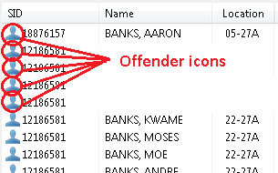
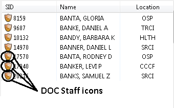
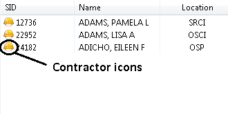
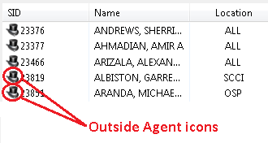
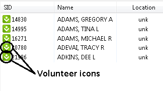
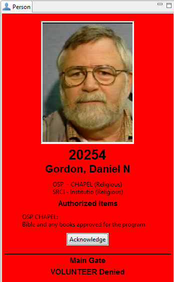
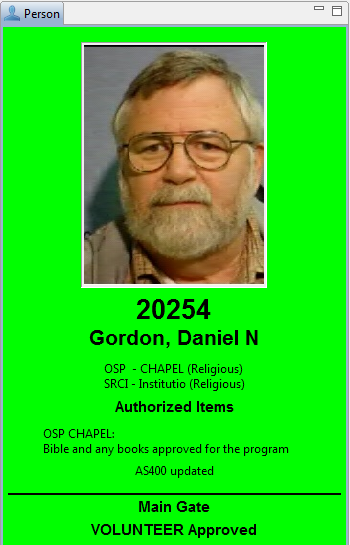

# Person Types

Schedule Track is currently capable of scanning several different types of people: offenders, DOC staff, contractors and volunteers. As each type of person can be processed differently, here is some additional information about each type:

## Offenders

Can be approved or denied based on:

* housing assignment,
* custody level,
* incentive level
* calendar events \(callouts\)

## Staff

No validation is performed, all DOC staff are accepted whose card is in good standing.

## Contractors

No validation is currently performed for contractors; all DOC-approved contractors are accepted whose card is in good standing.

## Outside Agents

Outside agents are non-DOC personnel who are employed by another law enforcement related agency. No validation is currently performed for outside agents; all DOC-approved outside agents are accepted whose card is in good standing.

## Volunteers

Volunteers are DOC-approved unpaid volunteer staff, who often come to the institutions to provide various services such as religious ceremonies, mentoring, or art/craft-related activities.

## Authorized Items & Acknowledgement

In some instances, some volunteers have been pre-approved to bring in specific items that without the pre-approval these items would be considered contraband. Schedule Track can identify these volunteers who have been pre-approved to carry such items inside.

When such a volunteer scans in, Schedule Track can be configured _**to initially mark them denied**_ until the officer has verified that the volunteer is currently carrying items that appear on the volunteer’s Authorized Items list. Once verified by the officer, _**the officer will need to click the Acknowledgement button**_; this will allow the rest of the validation to process, and unless there’s a different problem, the Volunteer will be "Approved" and the Person panel will display the Volunteer with the green background.

To configure Schedule Track to require acknowledgement of Volunteer items, edit the Volunteer Filter under Settings, and check the “Acknowledge Items” option.

