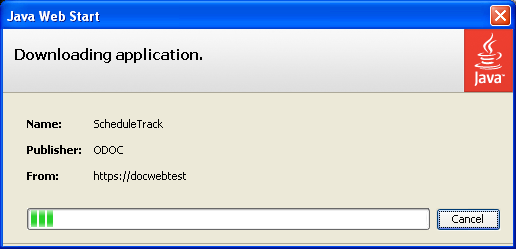
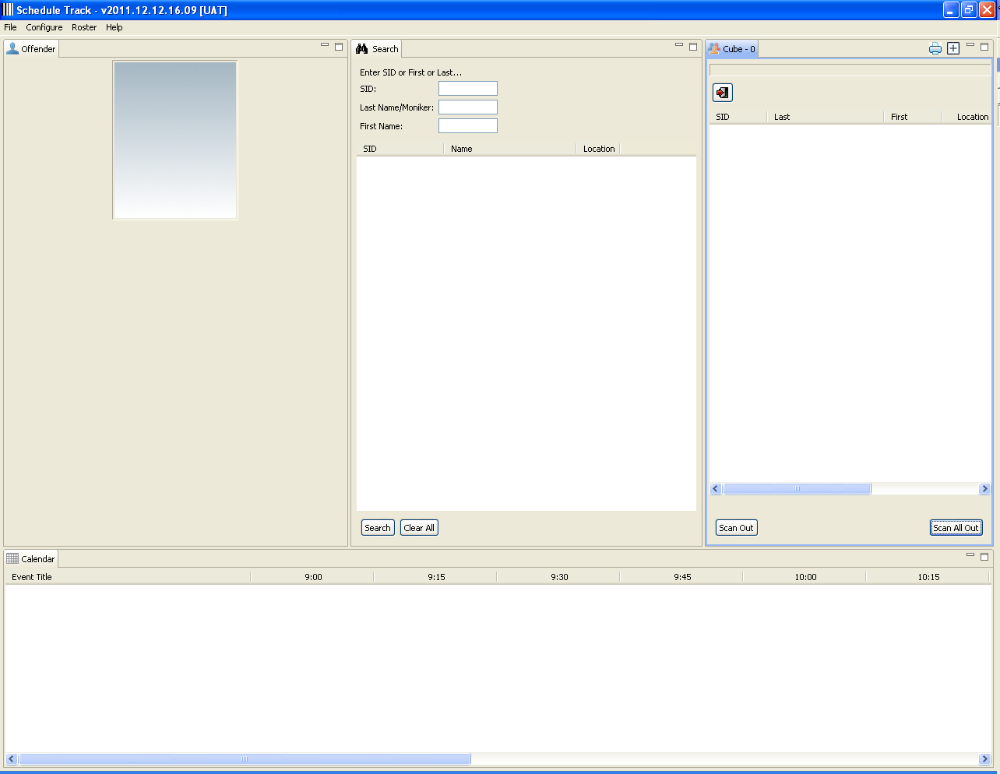
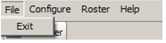
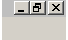
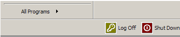

# Roles Used in Schedule Track

## Staff

Any staff with a CIS logon can operate Schedule Track. Staff are responsible to ensure each person scans their ID cards. If a card will not scan, the ID number can be entered manually using the Search function. Staff are also responsible to override denied scans and enter comments when appropriate as directed by local management.

## Super Users

Schedule Track super users, in addition to all rights normal staff have, also have the authority and responsibility to add scanners, filters, set parameters for the acceptance and denial of scanned ID cards, sounds associated with denial, marginal and accepted scans. Super users permissions are managed through the Offender Management System \(OMS\).

In addition, there are reports within OMS which can review historical scanning activity; these OMS reports can be assigned to any individual upon request.

## Login

1. Double-click on the Schedule Track icon on the computer desktop.  

2. When there are new updates to Schedule Track, the following panel will appear, showing that the updates are being downloaded to the computer.

The green Progress Bar indicates the progress of the download.

3. The Schedule Track splash screen displays to show things are loading. 

4. When Schedule Track first opens, the following workbench will be displayed.  

## Logout

Each staff member must log out prior to another staff member can begin operating Schedule Track. To log out, close the Schedule Track application in one of two ways:

* By selecting File from the top menu and then Exit. 

* Or by selecting the "X" in the upper right corner of the application. 

 Next, log off the computer: select the Start button and then the Log Off button. 

